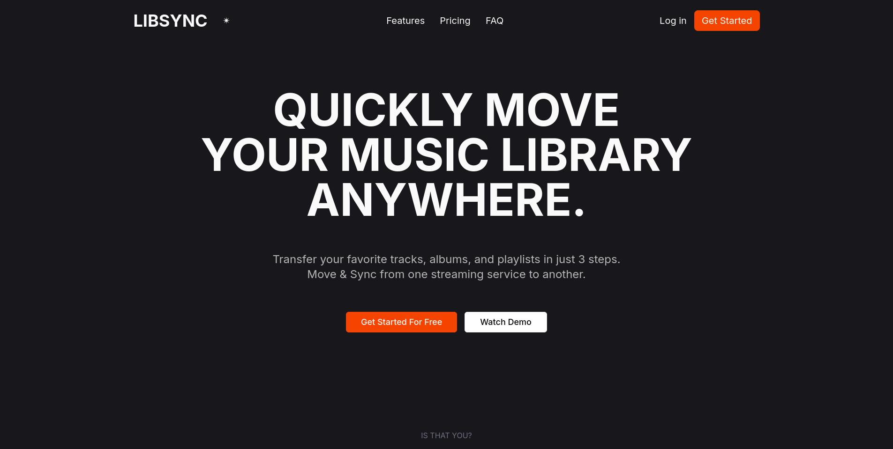

# LIBSYNC



Transfer your music library across streaming platforms - Spotify, Deezer, Apple Music and more.

## Quick Start

### Prerequisites
- Node.js 18+ (via nvm)
- npm or pnpm

### Setup

1. **Clone the repository**
```bash
git clone https://github.com/lejcestlesang/libsync-front.git
cd libsync-front
```

2. **Install dependencies**
```bash
npm install
# or
pnpm install
```

3. **Configure environment variables**

Create a `.env` file in the project root:

```bash
cp .env.example .env
```

Then edit `.env` and add your API credentials:

**Spotify Setup:**
- Go to [Spotify Developer Dashboard](https://developer.spotify.com/dashboard)
- Create a new app
- Add redirect URI: `http://localhost:5173/callback/spotify`
- Copy Client ID to `.env`
- **Important:** Add your Spotify email to "Users and Access" in app settings (Development Mode)

**Deezer Setup:**
- Go to [Deezer Developers](https://developers.deezer.com/myapps)
- Create a new app
- Add redirect URI: `http://localhost:5173/callback/deezer`
- Copy App ID to `PUBLIC_DEEZER_APP_ID` in `.env`
- Copy Secret Key to `PRIVATE_DEEZER_APP_SECRET` in `.env`

4. **Run development server**
```bash
npm run dev
```

Visit `http://localhost:5173`


-----


# sv

Everything you need to build a Svelte project, powered by [`sv`](https://github.com/sveltejs/cli).

## Creating a project

If you're seeing this, you've probably already done this step. Congrats!

```bash
# create a new project in the current directory
npx sv create

# create a new project in my-app
npx sv create my-app
```

## Developing

Once you've created a project and installed dependencies with `npm install` (or `pnpm install` or `yarn`), start a development server:

```bash
npm run dev

# or start the server and open the app in a new browser tab
npm run dev -- --open
```

## Building

To create a production version of your app:

```bash
npm run build
```

You can preview the production build with `npm run preview`.

> To deploy your app, you may need to install an [adapter](https://svelte.dev/docs/kit/adapters) for your target environment.


## Authentication Flow

### Spotify - PKCE OAuth 2.0
- Uses Authorization Code flow with PKCE (Proof Key for Code Exchange)
- No client secret needed on frontend
- More secure for public clients
- Diagram: [PKCE workflow](images/pkce_diagram.png)

### Deezer - OAuth 2.0
- Uses standard Authorization Code flow
- Requires app secret (stored in backend/env)
- Token exchange happens server-side

## Architecture

```
Frontend (SvelteKit)
├── /lib/auth/          # OAuth initiation
├── /lib/stores/        # Auth state management  
├── /routes/callback/   # OAuth callbacks
└── /routes/api/        # Token exchange endpoints
```

## Next Steps

Once both Spotify and Deezer are connected:
1. Fetch user playlists from source platform
2. Display tracks in UI
3. Map tracks to destination platform (fuzzy matching)
4. Create/update playlists on destination platform

## Tech Stack
- **Frontend:** SvelteKit, TailwindCSS, TypeScript
- **UI Components:** shadcn-svelte (bits-ui)
- **Auth:** OAuth 2.0 (PKCE for Spotify, standard for Deezer)
